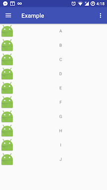
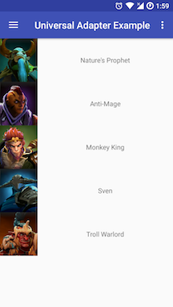
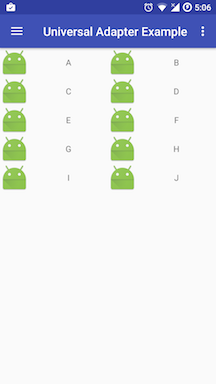
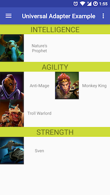
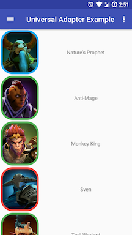

# UniversalAdapter

`RecyclerView` is the mandatory view needed for almost Android applications. If you are tired of creating messy classes in order to work with `RecyclerView`, or if you don't want to copy the same base code again and again between projects, then `UniversalAdapter` is the one for you.

Yet another adapter class for `RecyclerView` on Android, or perhaps, this will be the last one you need. With `UniversalAdapter`, you don't need to write a `RecyclerView.Adapter` ever again, including its' `ViewHolder`.

## Features

* No need to write `Adapter` class
* No need to write `ViewHolder` class
* Supports sectioned data with `categorizer`
* Designed with `callback` for every binding function. So you can handle for long time operations.
* `ImageView` load from local drawable resource or remote url via [Picasso](https://github.com/square/picasso).
* Customized binder is available for customized view.

## Setup

You can get via `jCenter()` in Gradle:

```groovy
compile 'me.timos.thuanle:universal-adapter:1.0.0'
```
Note: 

* Version `1.x.x` requies `SdkVersion` >= 9.

## Example  

### Hello world

Suppose we need to get a `RecyclerView` as below



You need 2 works:

* The `xml` layout for each item as below

```xml
<LinearLayout xmlns:android="http://schemas.android.com/apk/res/android"
              android:layout_width="match_parent"
              android:layout_height="wrap_content"
              android:orientation="horizontal">

    <ImageView
        android:id="@+id/thumb"
        android:layout_width="wrap_content"
        android:layout_height="wrap_content"
        android:layout_gravity="center"
        android:src="@mipmap/ic_launcher"/>

    <TextView
        android:id="@+id/tvTitle"
        android:layout_width="match_parent"
        android:layout_height="match_parent"
        android:gravity="center"/>
</LinearLayout>
```

* An `Adapter` instance created from our lib by a few lines of code

```java
UniversalAdapter.Builder<String> builder = UniversalAdapter.Builder.with("A", "B", "C", "D", "E", "F", "G", "H", "I", "J")
        .itemLayout(R.layout.item_simple);

builder.bindTextView(R.id.tvTitle)
        .text(new OnBindAsyncAction<String, CharSequence>() {
            @Override
            public void map(int position, String data, DataCallback<CharSequence> callback) {
                callback.onResult(data);
            }
        });

UniversalAdapter<String> adapter = builder.build();
```

That's all. No need create `Adapter` class. No need to create `ViewHolder` class. Let us do the boilerplate part.

#### Explaination

* Firstly, we create the builder pattern for the adapter as

```java
UniversalAdapter.Builder<String> builder = UniversalAdapter.Builder.with("A", "B", "C", "D", "E", "F", "G", "H", "I", "J")
```

* Then, we need to declare the layout of each item by using `itemLayout`

```java
.itemLayout(R.layout.item_simple)
```

* Next step, we need to guide *how the data is display* or *binding step*. In this example we bind the `TextView` with id `R.id.tvTitle` with the text at that position.

```java
builder.bindTextView(R.id.tvTitle)
        .text(new OnBindAsyncAction<String, CharSequence>() {
            @Override
            public void map(int position, String data, DataCallback<CharSequence> callback) {
                callback.onResult(data);
            }
        });
```
The `.text(..)` is corresponding the action `setText` for the `TextView`, you need to point the title you want to set in function `void map(int position, String data, DataCallback<String> callback)` with

* `position` is the position of current item in the adapter.
* `data` is the corresponding data of current item in the adapter.
* `callback` provide you the method to return the data will be taken action (in this case, the data will be call as `setText(data)`. As we want the title will be the same as the data, so will call `callback.onResult(data)`

**Note**:

* In the 3rd step, we break the chain call. Each bind options for a specific view should call the original builder by begining the  statement with `builder.bind....`.  If you dig deeper, the call `builder.bindTextView` does not return the `UA-Builder`. It returns the `TextView-Builder` which allow add binding options for  the selected `TextView`.

* There is a question, why dont just simplify the `map` to return direct the result, for example `String map(position, data)`. The answer is with `callback` approach, you don't get ANR in case you need a long time operations (such as download image from the internet, you can find more in other examples). But you need to handle the thread by yourself. 

### Advance usage

You can check the complete examples in the [example](https://github.com/ldt116/UniversalAdapter/tree/master/example) project

* [Binding image view](doc/usage-image.md)



* [Sectoned and Grid Adapter](doc/usage-group.md)

 

* [Binding custom view](doc/usage-custom-view.md)

 

### Using with lambda

From our experience, with lambda function supported, the code will be more readable. For example

```java
UniversalAdapter.Builder<Skill> builder = UniversalAdapter.Builder.with(hero.skills)
        .itemLayout(R.layout.item_hero_skill);
builder.bindTextView(R.id.tvTitle)
        .text((position, data, callback) -> callback.onResult(data.name));
builder.bindImageView(R.id.ivThumb)
        .image((position, data, callback) -> callback.onResult(data.thumbnail));

UniversalAdapter<Skill> ua = builder.build();
```

## TODO

Here is the list for future work

* Binders for common widgets such as `Button`, `Spinner`. etc.
* Ability add new view type and it binders.
* Example for `visibility` such as `View.goneWhen`, `View.invisibleWhen`

Acknowledgements
----------------

3rd party libraries used in `UniversalAdapter`:

* [Google Guava](https://github.com/google/guava)
* [Picasso](https://github.com/square/picasso)

Contribution
------------ 

Please fork this repository and contribute back using [pull requests](https://github.com/ldt116/UniversalAdapter/pulls).

Any contributions, large or small, major features, bug fixes, additional language translations, unit/integration tests are welcomed and appreciated but will be thoroughly reviewed and discussed.

License
-------
    
    MIT License
    
    Copyright (c) 2017 ThuanLe
    
    Permission is hereby granted, free of charge, to any person obtaining a copy
    of this software and associated documentation files (the "Software"), to deal
    in the Software without restriction, including without limitation the rights
    to use, copy, modify, merge, publish, distribute, sublicense, and/or sell
    copies of the Software, and to permit persons to whom the Software is
    furnished to do so, subject to the following conditions:
    
    The above copyright notice and this permission notice shall be included in all
    copies or substantial portions of the Software.
    
    THE SOFTWARE IS PROVIDED "AS IS", WITHOUT WARRANTY OF ANY KIND, EXPRESS OR
    IMPLIED, INCLUDING BUT NOT LIMITED TO THE WARRANTIES OF MERCHANTABILITY,
    FITNESS FOR A PARTICULAR PURPOSE AND NONINFRINGEMENT. IN NO EVENT SHALL THE
    AUTHORS OR COPYRIGHT HOLDERS BE LIABLE FOR ANY CLAIM, DAMAGES OR OTHER
    LIABILITY, WHETHER IN AN ACTION OF CONTRACT, TORT OR OTHERWISE, ARISING FROM,
    OUT OF OR IN CONNECTION WITH THE SOFTWARE OR THE USE OR OTHER DEALINGS IN THE
    SOFTWARE.
